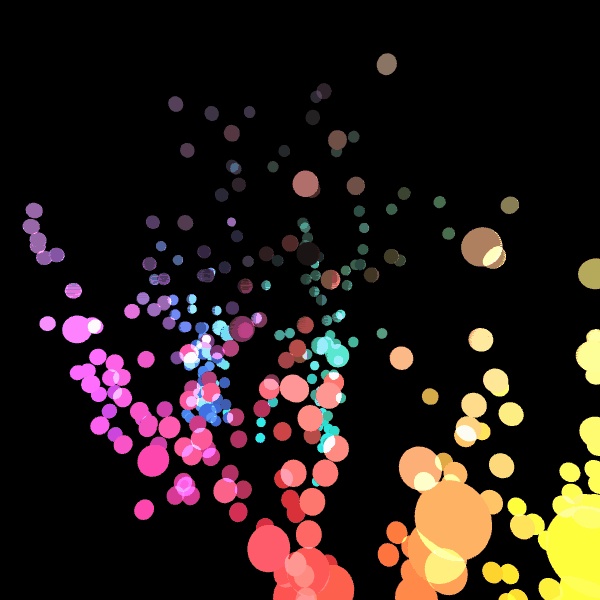

# CGbase_report
## Interactive Media Art with Leap Motion

Map each pixel color of the image to 3D as a sphere using hue, Saturation and Brightness.

And this can be operated with Leap Motion

# LICENSE
MIT LICENSE
